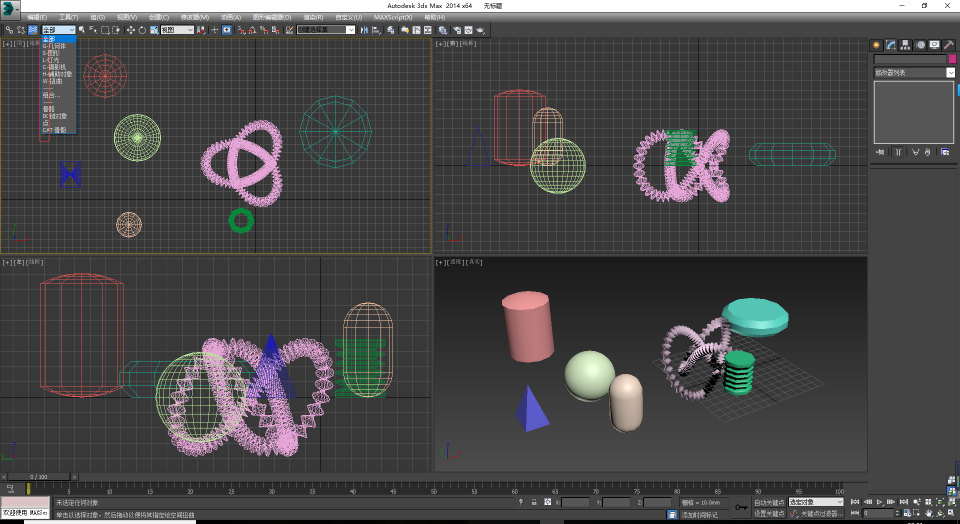
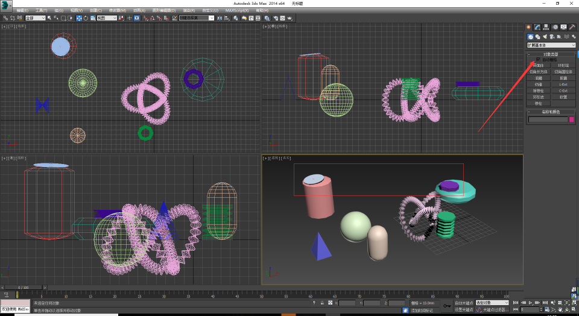

3D Max学习笔记
==============

## 界面


- 自定义单位长度为毫米
- 自定义锁电UI布局
- 自定义文件备份间隔15分钟
- 自动备份的文件在：```C:\Users\当前用户名\Documents\3dsMax\autoback``` 目录下

## 创建

- 左键选形状，拖动创建，右键结束
- 移动视图：按住鼠标滚轮
- 视图缩放：滚动鼠标滚轮，以鼠标放的地方为中心缩放
- 环绕观察：```alt``` +鼠标滚轮
- 最大化显示视图：```Z```
- 最大化视图：```alt + W```
- 最大化某个物体：


- 透明化物体：```alt + x```
- 显示隐藏栅格：```G```

## 渲染


## 选中模式


自定义 - 首选项 - 按方向交叉/窗口选择

`Ctrl` + 鼠标 累加选择
`Alt` + 鼠标 减选

## 隐藏

Shift + 物体类型字母



## 自动栅格

在某平面上创建基本体：勾选自动栅格



## 选择并移动

选择并移动：```W```

参照物：世界坐标、局部坐标

## 复制

`Shift` + 鼠标拖动
